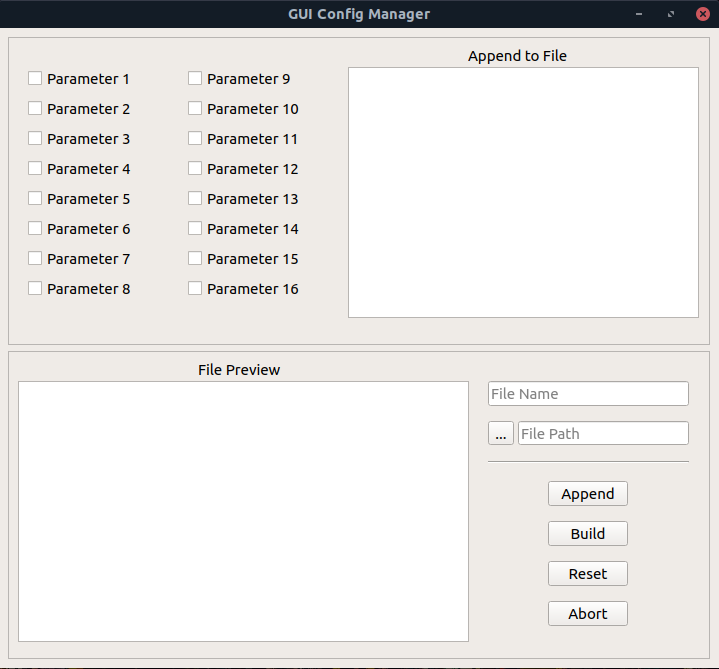
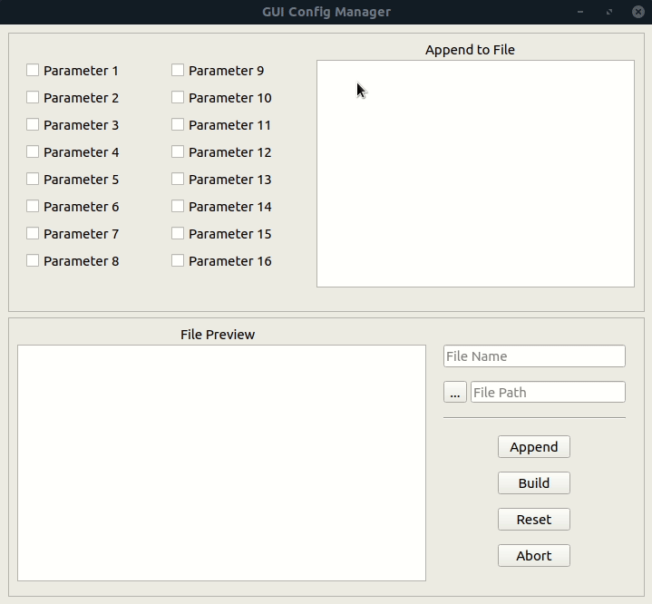
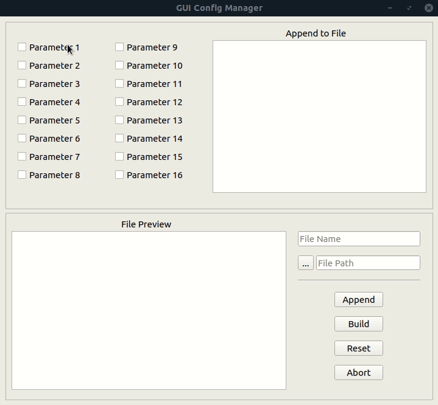
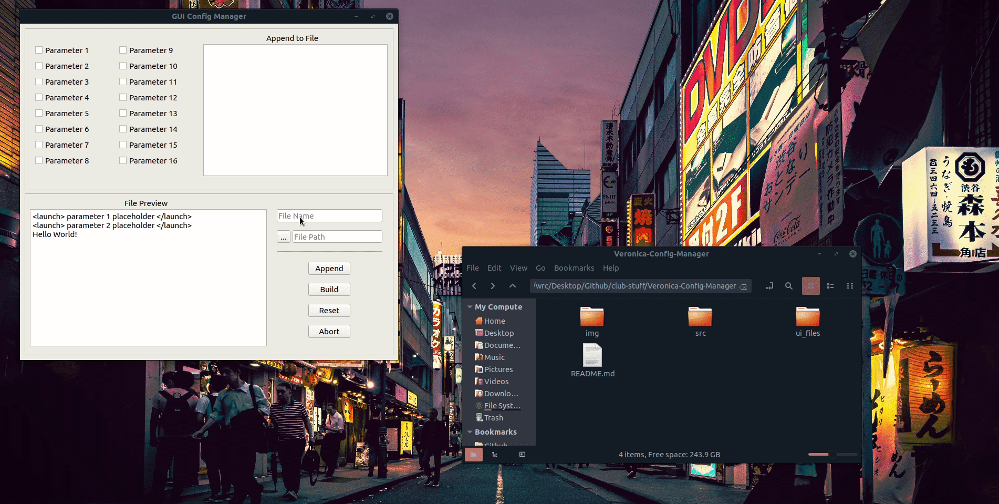

# Veronica-Config-Manager
A simple Text Editor for creating and configuring launch files.
## Preview
This is what the tool looks like. 

## Parameters
You can add parameter by checking them and remove them by un-checking them sequentially. 

## Custom Parameters
You can add custom parameters by writing them in the upper "Append to File" and clicking the append button. You can also add them directly to the "File Preview" text editor. 

## Reset Program
You can reset the entire program by clicking the reset button. 

## Build File
You can build the file by adding a file name, choosing a directory path to save it to, and clicking the build button. 

## Close Program
You can close the program by using the abort button or by using the window exit button. 
